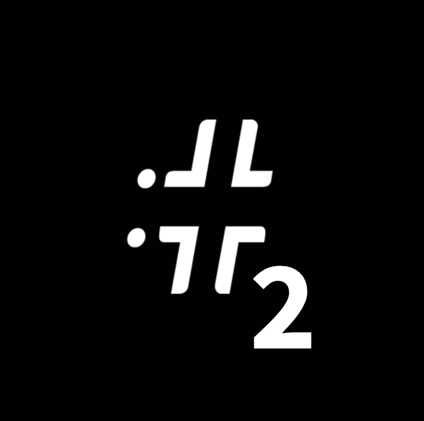

# May 15th

Soon here on interwebz near you wherever you are. We gonna be chasing dem bad guys, so GET READY

The event has two tracks both happening at the same time, so you've got some decisions to make

# Schedule

### Track 1 - Talks

| Speaker | Title| Time
| --- | --- | --- |
| [Benjamin Särkkä](speakers#benjamin-särkkä) | Pulling On The String | 17.00 EEST (14.00 UTC) |
| [Antti Kurittu](speakers#antti-kurittu) | Five Ways To Fail At Crime | 18.00 EEST (15.00 UTC) |
| [Nick Jones](speakers#nick-jones) | Spotting the Storm: Attack Detection in the Cloud | 19.00 EEST (16.00 UTC) |
| [Tommy DeVoss](speakers#tommy-devoss) | Hunted: from Wanted Blackhat to Celebrated Whitehat | 20.00 EEST (17.00 UTC) |
| [Plug](speakers#plug) | Silver Sparrow and the Tale of the Mysterious Insu File | 21.00 EEST (18.00 UTC)  |

### Track 2 - Workshops

Two workshops, 2.5 hrs each

| Speaker | Subject | Time
| --- | --- | --- |
| [Juho Jauhiainen](speakers#juho-jauhiainen) | Forensics Crash Course | 17.00 EEST (14.00 UTC) |
| TBA | TBA | TBA |

# FAQ

Please join CitySec Events Discord server where you’ll able to chat with other participants and ask questions from the presenters during the event on May 15th.

[https://discord.gg/psZCTzskre](https://discord.gg/psZCTzskre)

## So what’s this MAYhem all about now?
The answer is very simple: we wanted to create something to cheer up the cyber security
community. Hope this will do the trick until we can all meet each other again irl &lt;3

## Does it cost anything to participate?
Zero, zilch, zip, nil, nought, nothing. You can high five us later.

## I’m not able to join but I’d really want to! Will the talks and all be recorded?

Unfortunately no, as the people behind the event are all in this voluntarily, so for that reason we see no point in creating yet another channel to keep up with only for this purpose.

And the second reason is that we’re not sure whether the event is something will do again
in 2022.

## Where can I follow the streams?

Both tracks have their own stream each; you'll also find the buttons for each streams from top right of this page, but here they are again:

Track 1: Talks [https://www.twitch.tv/citysecs](https://www.twitch.tv/citysecs)

Track 2: Workshops [https://www.twitch.tv/citysecs2](https://www.twitch.tv/citysecs2)

## I want to ask something from the presenters. How can I present my question?

All the communication happens on Discord, so make sure you’ve joined the server. You have two channels to choose from:

Track 1: Talks  
Track 2: Workshops

Each track has their own subchannels on Discord for chatting and asking questions. Team MAYhem will pick the questions for the presenter to answer at the end of each presentation.

## What time is it?

It's almost MAYhem o'clock! A few more weeks to go!

## In case you need to know more

If there’s something we’ve not covered in this FAQ, ping us on Twitter! There's an icon at the bottom of the page.
We use Twitter as the event's main communication channel, so make sure to follow us to keep up with the latest updates.

