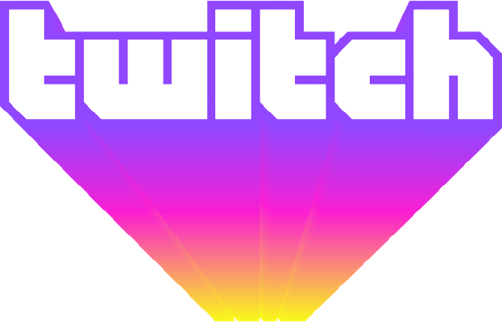

# May 15th

Soon here on interwebz near you wherever you are. We gonna be chasing dem bad guys, so GET READY

The event has two tracks both happening at the same time, so you've got some decisions to make

# Schedule

### Track 1 - Talks

| Speaker | Title| Time
| --- | --- | --- |
| [Benjamin Särkkä](speakers#benjamin-särkkä) | Pulling On The String | 17.00 EEST (14.00 UTC) |
| TBA | TBA | TBA |
| TBA | TBA | TBA |
| TBA | TBA | TBA |
| TBA | TBA | TBA |

### Track 2 - Workshops

Two workshops, 2.5 hrs each

| Speaker | Subject | Time
| --- | --- | --- |
| [Juho Jauhiainen](speakers#juho-jauhiainen) | Forensics Crash Course | 17.00 EEST (14.00 UTC) |
| TBA | TBA | TBA |

