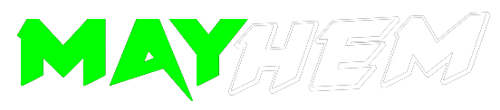

# It was a blast -thank you <3 

We did not record the workshop track so no video recording available afterwards.
Talk track recording will be edited before adding it to Disobey's YouTube; we'll let u know when it's there!

[https://www.youtube.com/c/Disobey](https://www.youtube.com/c/Disobey)

# FAQ

## So what’s this MAYhem all about now?
The answer is very simple: we wanted to create something to cheer up the cyber security
community. MAYhem is a joint effort by the CitySecs of the cold North.

## Does it cost anything to participate?
Zero, zilch, zip, nil, nought, nothing. You can high five us later.

## I’m not able to join but I’d really want to! Will the talks and all be recorded?

As both tracks are streamed on Twitch, they'll be available there for two (2) weeks after the event. After that, you'll find all the streamed content on Disobey's YouTube channel. We'll let you know when.

## Saw some cool stickers made especially for the event. Where can I get one?

Depending on which CitySec area you live in, you'll get one from your CitySec representative. The existing CitySecs are listed here [https://www.citysec.fi](https://www.citysec.fi)

