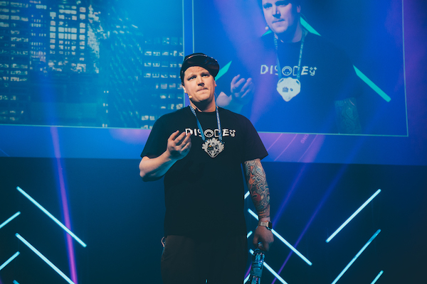
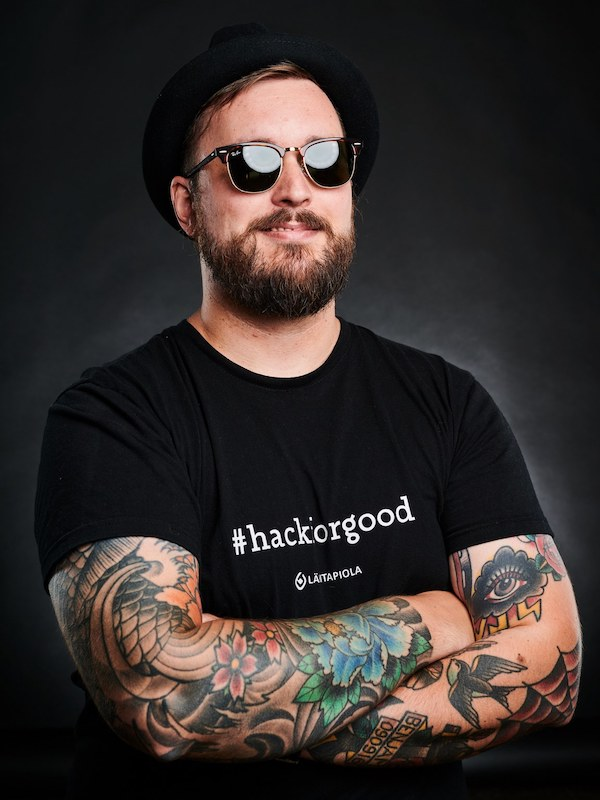
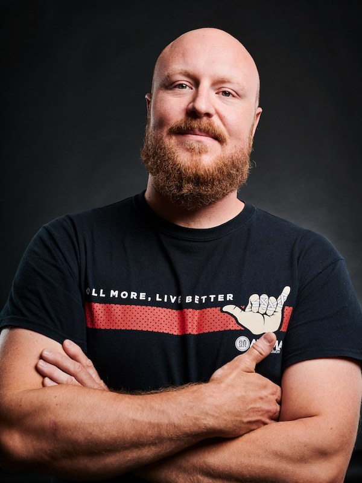
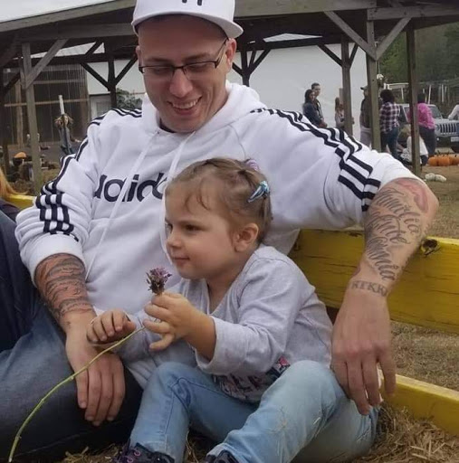

# Speakers

More speakers will be published soon. STAY TUNED //

## Benjamin Särkkä

 

 

 
Benjamin is a hacker with an inquisitive mind. He strives to understand the root cause of problems and feels passionate about helping others succeed. 

He has lectured at universities, starred in the hit show Team Whack, founded the Disobey organisation and helped build an incident response team for the largest financial player in the Nordics. 

Benjamin was selected as the 2020 TiVi IT Influencer of the year in Finland, and feels that securing enterprises are more about understanding the basics and having a good IT hygiene rather than the AI-blockchain-hypebeast. 

Coming from humble beginnings he donates some of his time to volunteering and helping the underprivileged.

<a href="https://twitter.com/Notquiteyou" noopener noreferrer target="_blank">https://twitter.com/Notquiteyou</a> 
<a href="https://www.linkedin.com/in/igotroot/" noopener noreferrer target="_blank">https://www.linkedin.com/in/igotroot/</a>

 

 

 
## Juho Jauhiainen

 

 

 

Juho works as Information Security Specialist at NCSC-FI. Before NCSC-FI, he has worked in various positions doing security operations, digital forensics and incident response since 2014. His current role involves malware analysis, digital forensics and incident response. In his freetime, Juho runs HelSec Ry, hosts Turvakäräjät podcast and teaches forensics at National Defence Training Association of Finland. Juho is CISSP, GCFA, GMON, GREM and OSCP certified.

<a href="https://twitter.com/juhojauhiainen" noopener noreferrer target="_blank">https://twitter.com/juhojauhiainen</a> 
<a href="https://fi.linkedin.com/in/jauhiainen" noopener noreferrer target="_blank">https://fi.linkedin.com/in/jauhiainen</a> 
<a href="https://instagram.com/jauhiaine" noopener noreferrer target="_blank">https://instagram.com/jauhiaine</a>

 

 

 
## Antti Kurittu
 

 

 

Antti Kurittu is a former police officer from the Helsinki PD and has worked as a senior specialist for the NCSC-FI. Currently Antti is the Digital Forensics & Incident Response Team Lead at Nixu Oyj, a Finnish cyber security company. He also co-hosts the massively popular Turvakäräjät podcast together with Juho Jauhiainen and Laura Kankaala. In his spare time he touches computers and tries to do some Brazilian jiu jitsu. 

 

 

 
## Nick Jones

 

 

Nick Jones is the cloud security lead and a senior security consultant at F-Secure Consulting, where he focuses on AWS security and attack detection in advanced, cloud-native organisations. He has been delivering offensive security testing, consultancy and support to a world-wide client base, including some of the world's largest financial organisations, for over 7 years. Nick has previously spoken at t2, DEF CON Cloud Village, fwd:cloudsec, Cloud Native Security Day and DevSecCon, and maintains Leonidas, an open source framework for simulating attacks against cloud environments.

<a href="http://twitter.com/nojonesuk" noopener noreferrer target="_blank">http://twitter.com/nojonesuk</a> 
<a href="https://www.linkedin.com/in/nickojones" noopener noreferrer target="_blank">https://www.linkedin.com/in/nickojones</a>

 

 

 
## Tommy DeVoss

 

 

Tommy is a 37-year-old hacker from Richmond Virginia. He started out as a blackhat in the mid 90s and continued on this path until his final release from prison in 2010. Upon being released from prison, Tommy began a career as a Unix System Admin, and a Bug Bounty Hunter. Since then, he had become one of the highest paid and most well-known Bug Bounty Hunters on the planet featured in the news frequently, as well as in documentaries done by Bloomberg and others.

<a href="https://twitter.com/thedawgyg" noopener noreferrer target="_blank">https://twitter.com/thedawgyg</a>

 

 

## Speaker 6
 TBA
 
## Speaker 7
 TBA
